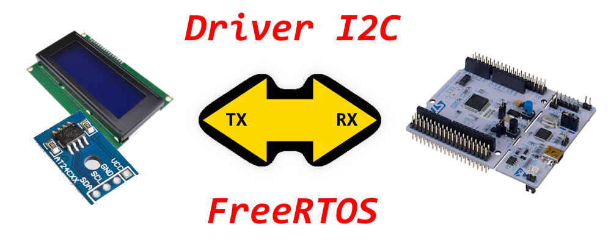

# FIUBA - Electrónica - Sistemas Operativos Embebidos

## Trabajo Final - Device Driver de FreeRTOS



### 2026-1erC - 1-03

### Integrantes del grupo:

| Padrón | Apellidos, Nombres | Fecha | Deadline |
| :----- | :--------------------- | :------: | :-------: |
| 110901 | Chechko, Víctor Nicolás | - | 12 AGO 26 |
| 109308 | Marconi Casares, Lourdes | - | 12 AGO 26 |
| 109324 | Solari Parravicini, Facundo | - | 12 AGO 26 |

---
### Objetivos

El objetivo principal de este Trabajo Final es diseñar e implementar la evolución de un Device Driver modular en FreeRTOS sobre microcontroladores STM32. A lo largo de 14 actividades, se integran paulatinamente distintas estrategias de comunicación física (Polling, Interrupciones y DMA) junto con técnicas de gestión de memoria dinámica (*Memory Pool* por referencia) y primitivas de sincronización (*Gatekeeper Task*, Colas y Semáforos).

---

#### Resumen de Actividades

#### Transmisión

* **[Actividad 01](./soe-tf_01-application.md) (Polling):** Transmisión de mensajes paso por valor utilizando colas de FreeRTOS (`xQueue`). La `Gatekeeper Task` ejecuta la transferencia mediante espera activa (*Polling*) sobre el bus.
* **[Actividad 02](./soe-tf_02-application.md) (Memory Pool & Polling):** Transmisión paso por referencia. Las tareas asignan memoria dinámica (`pvPortMalloc`), envían el puntero por la cola y el `Gatekeeper` transmite por Polling para luego liberar la memoria (`vPortFree`).
* **[Actividad 03](./soe-tf_03-application.md) (Interrupt):** Transmisión paso por valor asistida por interrupciones (IT). La `Gatekeeper Task` inicia la transferencia y se bloquea en un semáforo binario hasta que la ISR de fin de transmisión lo entrega.
* **[Actividad 04](./soe-tf_04-application.md) (Memory Pool & Interrupt):** Transmisión por interrupciones combinada con paso por referencia. La liberación de memoria dinámica se realiza en el `Gatekeeper` recién al despertar tras la interrupción del hardware.
* **[Actividad 05](./soe-tf_05-application.md) (DMA):** Transmisión por Direct Memory Access (DMA) con paso por valor. El hardware descarga a la CPU de la transferencia byte a byte, notificando su finalización mediante la ISR de DMA.
* **[Actividad 06](./soe-tf_06-application.md) (Memory Pool & DMA):** Máxima optimización en transmisión. Combina el paso por referencia con transferencias por DMA, sincronizando la liberación del bloque del *Heap* mediante semáforos e interrupciones de DMA.

#### Recepción

* **[Actividad 07](./soe-tf_07-application.md) (Known Length & Polling):** Recepción de tramas de longitud fija mediante espera activa (*Polling*), utilizando paso por valor para comunicar los datos recibidos.
* **[Actividad 08](./soe-tf_08-application.md) (Known Length & Memory Pool & Polling):** Recepción de longitud conocida por Polling. Se solicita memoria en el receptor/Gatekeeper para almacenar los datos recibidos y transmitir su puntero por la cola.
* **[Actividad 09](./soe-tf_09-application.md) (Known Length & Interrupt):** Recepción de tramas de longitud fija por interrupción. La tarea se bloquea hasta recibir la notificación de hardware de buffer lleno.
* **[Actividad 10](./soe-tf_10-application.md) (Known Length & Memory Pool & Interrupt):** Recepción de longitud conocida combinando interrupciones de hardware con asignación dinámica de memoria (*Memory Pool*) por referencia.
* **[Actividad 11](./soe-tf_11-application.md) (Unknown Length & Memory Pool & Interrupt):** Recepción de tramas de longitud variable por interrupción (detección de línea libre / *IDLE Line*). Se asigna memoria dinámica dinámicamente según la cantidad real de bytes recibidos.
* **[Actividad 12](./soe-tf_12-application.md) (Known Length & DMA):** Recepción de longitud fija utilizando DMA para escribir datos directamente en memoria RAM sin intervención de la CPU durante la transferencia.
* **[Actividad 13](./soe-tf_13-application.md) (Known Length & Memory Pool & DMA):** Recepción por DMA a longitud fija utilizando bloques de memoria dinámica gestionados mediante paso por referencia.
* **[Actividad 14](./soe-tf_14-application.md) (Unknown Length & Memory Pool & DMA):** Máxima optimización en recepción. Integración de DMA con interrupción por *IDLE Line* y gestión de memoria dinámica para capturar tramas de tamaño variable con costo mínimo de CPU.
---

### Funciones de Driver Implementadas

```c
// Función del driver I2C para imprimir un mensaje
// en la posición (x,y) de una pantalla LCD.
void i2c_lcd_puts_x_y(I2C_LCD_HandleTypeDef *lcd, int col, int row, char *str)
```

```c
// Función del driver I2C para leer una memoria.
HAL_StatusTypeDef i2c_mem_read(I2C_HandleTypeDef *hi2c, uint16_t device_address, uint16_t memory_address, uint16_t memory_add_size, uint8_t *p_rx, uint16_t size, uint32_t timeout)
```

---

### Cuadro Comparativo

#### Transmisión

| Actividad | Tipo            | Tiempo Bloqueante [μS] | Tiempo Total [μS] | Eficiencia CPU | Manejo de Memoria    |
| :-------: | :-------------: | :--------------------: | :---------------: | :------------: | :------------------: |
| 01        | Polling         | -                      | -                 | Baja           | Inseguro             |
| 02        | Polling         | -                      | -                 | Baja           | Seguro (Memory Pool) |
| 03        | Interrupt       | -                      | -                 | Media          | Inseguro             |
| 04        | Interrupt       | -                      | -                 | Media          | Seguro (Memory Pool) |
| 05        | DMA             | -                      | -                 | Alta           | Inseguro             |
| 06        | DMA             | -                      | -                 | Alta           | Seguro (Memory Pool) |

<br>

#### Recepción

| Actividad | Tipo                     | Tiempo Bloqueante [μS] | Tiempo Total [μS] | Eficiencia CPU | Manejo de Memoria    |
| :-------: | :----------------------: | :--------------------: | :---------------: | :------------: | :------------------: |
| 07        | Polling Known Length     | -                      | -                 | Baja           | Inseguro             |
| 08        | Polling Known Length     | -                      | -                 | Baja           | Seguro (Memory Pool) |
| 09        | Interrupt Known Length   | -                      | -                 | Media          | Inseguro             |
| 10        | Interrupt Known Length   | -                      | -                 | Media          | Seguro (Memory Pool) |
| 11        | Interrupt Unknown Length | -                      | -                 | Media          | Seguro (Memory Pool) |
| 12        | DMA Known Length         | -                      | -                 | Alta           | Inseguro             |
| 13        | DMA Known Length         | -                      | -                 | Alta           | Seguro (Memory Pool) |
| 14        | DMA Unknown Length       | -                      | -                 | Alta           | Seguro (Memory Pool) |

---

### Obtención de Tiempos

Para medir el tiempo transcurrido entre dos instrucciones o eventos, se realizó el siguiente procedimiento:

```c
// Asegurarse de incluir el archivo de DWT (Data Watchpoint and Trace).
#include "dwt.h"

// Reiniciar el contador en el punto de inicio.
cycle_counter_reset();

// (lista de instrucciones o eventos a medir)
// ...

// Obtener el contador en el punto final.
uint32_t time = cycle_counter_get_time_us();

// Imprimir el tiempo por consola (o bien colocar un breakpoint
// y leer el valor en 'Expressions').
LOGGER_INFO("Tiempo = %lu us", time);
```

---
