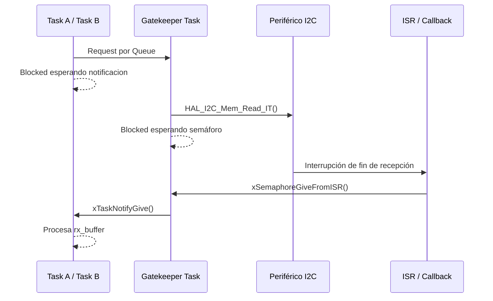

# Reporte de Desarrollo - Trabajo Práctico Final: Device Drivers en RTOS
**Actividad 09: Device Driver - Recepción (Known Length & Interrupt & Gatekeeper Task)**

## 1. Introducción:

En esta actividad se evoluciona el mecanismo de recepción utilizado anteriormente, reemplazando la lectura mediante **Polling** por una implementación basada en **interrupciones (IT)**.

La arquitectura general se mantiene: las tareas envían solicitudes mediante una cola y la **Gatekeeper Task** centraliza el acceso al periférico I²C. La principal diferencia es que ahora la Gatekeeper inicia la lectura y se bloquea, permitiendo que el procesador ejecute otras tareas mientras el periférico realiza la transferencia.

---

## 2. Desarrollo:

### 2.1. Cambio de Polling a Interrupciones

La modificación principal del driver consiste en reemplazar:

```c
HAL_I2C_Mem_Read(...)
````

por su versión no bloqueante:

```c
HAL_StatusTypeDef i2c_mem_read(
    I2C_HandleTypeDef *hi2c,
    uint16_t device_address,
    uint16_t memory_address,
    uint16_t memory_add_size,
    uint8_t *p_rx,
    uint16_t size)
{
    return HAL_I2C_Mem_Read_IT(
        hi2c,
        device_address,
        memory_address,
        memory_add_size,
        p_rx,
        size);
}
```

`HAL_I2C_Mem_Read_IT()` únicamente inicia la operación y retorna. La transferencia continúa siendo manejada por el periférico y sus interrupciones.

Esto permite evitar que la Gatekeeper permanezca ejecutando código de Polling durante toda la recepción.

### 2.2. Sincronización mediante semáforo

Para conocer cuándo terminó la transferencia se agregó un **semáforo binario**:

```c
h_i2c_rx_sem = xSemaphoreCreateBinary();
configASSERT(h_i2c_rx_sem != NULL);
```

La Gatekeeper inicia la recepción y luego queda bloqueada esperando dicho semáforo:

```c
i2c_mem_read(&hi2c2,
             0xA0,
             i2c_rx_req->address,
             I2C_MEMADD_SIZE_16BIT,
             i2c_rx_req->rx_buffer,
             i2c_rx_req->length);

xSemaphoreTake(h_i2c_rx_sem, portMAX_DELAY);

xTaskNotifyGive(i2c_rx_req->requester_task);
```

El flujo de recepción pasa a ser:



Durante la transferencia (a diferencia de Polling), la Gatekeeper se encuentra en estado **Blocked**, dejando disponible la CPU.

### 2.3. Callback de finalización

Cuando la HAL detecta que la lectura terminó se ejecuta:

```c
void HAL_I2C_MemRxCpltCallback(I2C_HandleTypeDef *hi2c)
{
    if (hi2c->Instance == I2C2)
    {
        BaseType_t xHigherPriorityTaskWoken = pdFALSE;

        xSemaphoreGiveFromISR(
            h_i2c_rx_sem,
            &xHigherPriorityTaskWoken);

        portYIELD_FROM_ISR(xHigherPriorityTaskWoken);
    }
}
```

Como el callback se ejecuta en contexto de interrupción, se utiliza la variante:

```c
xSemaphoreGiveFromISR()
```

en lugar de la función convencional de FreeRTOS.

`portYIELD_FROM_ISR()` permite realizar inmediatamente un cambio de contexto si la interrupción desbloqueó una tarea de mayor prioridad.

Las interrupciones de eventos y errores del I²C2 también fueron habilitadas:

```c
HAL_NVIC_SetPriority(I2C2_EV_IRQn, 5, 0);
HAL_NVIC_EnableIRQ(I2C2_EV_IRQn);

HAL_NVIC_SetPriority(I2C2_ER_IRQn, 5, 0);
HAL_NVIC_EnableIRQ(I2C2_ER_IRQn);
```

La prioridad utilizada es compatible con `configLIBRARY_MAX_SYSCALL_INTERRUPT_PRIORITY`, permitiendo utilizar las funciones `FromISR()` de FreeRTOS.

### 2.4. Comparación con Polling

| Polling - Actividad 07                   | Interrupciones - Actividad 09           |
| ---------------------------------------- | --------------------------------------- |
| `HAL_I2C_Mem_Read()`                     | `HAL_I2C_Mem_Read_IT()`                 |
| Gatekeeper ocupada durante la lectura    | Gatekeeper bloqueada durante la lectura |
| CPU consulta continuamente al periférico | CPU interviene cuando ocurre un evento  |
| Implementación más simple                | Requiere ISR y sincronización           |
| Mayor consumo de CPU                     | Mejor aprovechamiento de CPU            |

La principal ventaja de las interrupciones es que el procesador puede realizar otro trabajo mientras avanza la transferencia I²C.

Como contrapartida, aumenta la complejidad del driver, ya que ahora deben coordinarse correctamente el **hardware, la ISR y las primitivas del RTOS**.

Además, cada evento de la transferencia continúa requiriendo intervención del procesador. Por este motivo, una futura implementación con **DMA** puede reducir todavía más la carga de CPU.

---

## 3. Conclusiones:

1. **Uso de CPU:** el reemplazo de Polling por interrupciones permite bloquear la Gatekeeper durante la transferencia, dejando disponible el procesador para ejecutar otras tareas.

2. **Tiempos de bloqueo y sincronización:** la finalización de la lectura se comunica desde la ISR mediante un semáforo, integrando correctamente los eventos del hardware con el scheduler de FreeRTOS.

3. **Protección de memoria:** el uso de buffers fijos dentro de cada request mantiene una administración de memoria simple y predecible, evitando asignaciones dinámicas durante la recepción y reduciendo el riesgo de fragmentación o fallos por falta de memoria.
