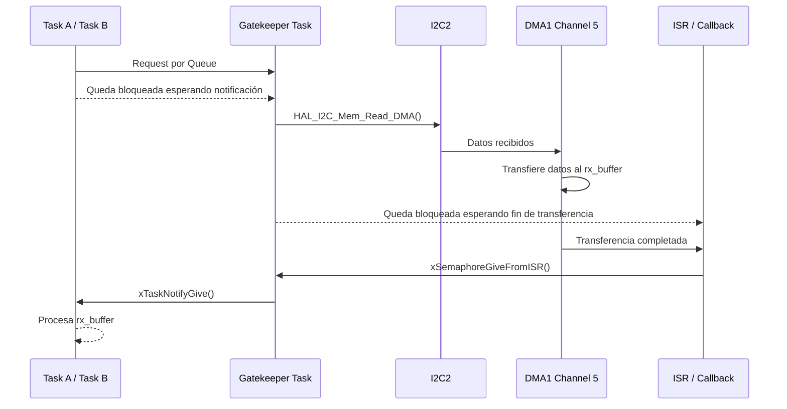

# Reporte de Desarrollo - Trabajo Práctico Final: Device Drivers en RTOS
**Actividad 12: Device Driver - Recepción (Known Length & DMA & Gatekeeper Task)**

## 1. Introducción:

En esta actividad se evoluciona nuevamente el mecanismo de recepción, reemplazando la transferencia manejada por **interrupciones** por una implementación basada en **DMA (Direct Memory Access)**.

La arquitectura de alto nivel se mantiene: las tareas generan requests, la Gatekeeper centraliza el acceso al I²C y la finalización de la operación se sincroniza mediante un semáforo y una Task Notification.

La diferencia principal es que ahora el **DMA se encarga de transferir los datos directamente desde el periférico I²C hacia el buffer en memoria**, reduciendo todavía más la intervención de la CPU durante la recepción.

---

## 2. Desarrollo:

### 2.1. Cambio de Interrupciones a DMA

El cambio principal del driver consiste en reemplazar:

```c
HAL_I2C_Mem_Read_IT(...)
````

por:

```c
HAL_StatusTypeDef i2c_mem_read(
    I2C_HandleTypeDef *hi2c,
    uint16_t device_address,
    uint16_t memory_address,
    uint16_t memory_add_size,
    uint8_t *p_rx,
    uint16_t size)
{
    return HAL_I2C_Mem_Read_DMA(
        hi2c,
        device_address,
        memory_address,
        memory_add_size,
        p_rx,
        size);
}
```

Con `HAL_I2C_Mem_Read_DMA()`, la CPU configura e inicia la operación, pero la transferencia de los bytes hacia memoria queda a cargo del controlador DMA.

Esto marca la principal diferencia respecto de la actividad anterior:

| Interrupciones - Actividad 09                                                     | DMA - Actividad 12                                                       |
| --------------------------------------------------------------------------------- | ------------------------------------------------------------------------ |
| La CPU participa en el manejo de la recepción mediante las interrupciones del I²C | El DMA transfiere los datos directamente a memoria                       |
| Mayor cantidad de intervención del procesador                                     | Menor carga de CPU durante la transferencia                              |
| No requiere configurar un canal DMA                                               | Requiere configurar y asociar un canal DMA                               |
| Adecuado para transferencias pequeñas                                             | Más conveniente al aumentar el tamaño o frecuencia de las transferencias |

### 2.2. Configuración del DMA

Para la recepción de `I2C2` se utiliza `DMA1_Channel5`, configurado para transferir datos desde el periférico hacia memoria:

```c
hdma_i2c2_rx.Instance = DMA1_Channel5;
hdma_i2c2_rx.Init.Direction = DMA_PERIPH_TO_MEMORY;
hdma_i2c2_rx.Init.PeriphInc = DMA_PINC_DISABLE;
hdma_i2c2_rx.Init.MemInc = DMA_MINC_ENABLE;
hdma_i2c2_rx.Init.PeriphDataAlignment = DMA_PDATAALIGN_BYTE;
hdma_i2c2_rx.Init.MemDataAlignment = DMA_MDATAALIGN_BYTE;
hdma_i2c2_rx.Init.Mode = DMA_NORMAL;
```

Luego se vincula el canal DMA con la recepción del periférico I²C:

```c
__HAL_LINKDMA(hi2c, hdmarx, hdma_i2c2_rx);
```

La configuración permite mantener fija la dirección del registro del periférico mientras la dirección de memoria se incrementa automáticamente a medida que se reciben los bytes.

También se habilita la interrupción correspondiente al canal DMA:

```c
HAL_NVIC_SetPriority(DMA1_Channel5_IRQn, 5, 0);
HAL_NVIC_EnableIRQ(DMA1_Channel5_IRQn);
```

### 2.3. Sincronización con FreeRTOS

Desde el punto de vista de la Gatekeeper, la lógica prácticamente no cambia respecto de la recepción por interrupciones:

```c
i2c_mem_read(&hi2c2,
             0xA0,
             i2c_rx_req->address,
             I2C_MEMADD_SIZE_16BIT,
             i2c_rx_req->rx_buffer,
             i2c_rx_req->length);

xSemaphoreTake(h_i2c_rx_sem, portMAX_DELAY);

xTaskNotifyGive(i2c_rx_req->requester_task);
```

La Gatekeeper inicia la recepción por DMA y queda bloqueada esperando el semáforo.

Cuando la transferencia termina, la HAL ejecuta nuevamente el callback:

```c
void HAL_I2C_MemRxCpltCallback(I2C_HandleTypeDef *hi2c)
{
    if (hi2c->Instance == I2C2)
    {
        BaseType_t xHigherPriorityTaskWoken = pdFALSE;

        xSemaphoreGiveFromISR(
            h_i2c_rx_sem,
            &xHigherPriorityTaskWoken);

        portYIELD_FROM_ISR(xHigherPriorityTaskWoken);
    }
}
```

Por lo tanto, el cambio a DMA afecta principalmente a **cómo se transfieren los datos**, mientras que el mecanismo de sincronización con FreeRTOS puede conservarse.

El flujo queda:



Es importante destacar que DMA **no elimina completamente el uso de interrupciones**. Éstas siguen siendo necesarias para gestionar eventos y detectar la finalización de la operación, pero la CPU deja de intervenir en la transferencia de cada byte hacia memoria.

### 2.4. Uso de buffer fijo

Para esta etapa se utiliza nuevamente un buffer fijo dentro del request:

```c
typedef struct {
    uint16_t address;
    uint16_t length;
    TaskHandle_t requester_task;
    uint8_t rx_buffer[MAX_MSG_LEN];
} i2c_rx_req_t;
```

Esto permite concentrar esta actividad específicamente en la incorporación y validación del DMA, manteniendo simple la gestión de memoria.

---

## 3. Conclusiones:

1. **Uso de CPU:** DMA reduce la intervención del procesador durante la recepción, ya que la transferencia de los bytes desde el I²C hacia memoria es realizada directamente por el controlador DMA.

2. **Sincronización:** la arquitectura de Queue, Gatekeeper, semáforo y Task Notification puede mantenerse prácticamente sin cambios; solamente se modifica el mecanismo utilizado internamente para realizar la transferencia.

3. **Escalabilidad:** frente a la recepción manejada únicamente mediante interrupciones, DMA resulta especialmente beneficioso para transferencias más largas o frecuentes, a costa de una mayor configuración del hardware y del uso de un recurso DMA dedicado.
